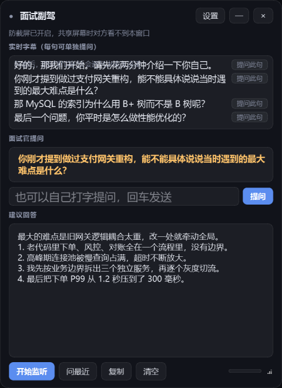

# 面试副驾（Interview Copilot）

实时抓取腾讯会议里面试官的声音 → 本地语音识别成文字 → 自动判断是不是提问 →
丢给大模型 → 在置顶悬浮窗里流式吐出**可以直接照着念**的回答。

全程不需要虚拟声卡，不需要开立体声混音，共享屏幕时对方也看不到这个窗口。



设置界面支持切换讯飞 / 本地识别引擎，并可直接测试连接。

---

## 它怎么工作

```
扬声器输出（腾讯会议里面试官的声音）
        │  WASAPI loopback 采集，无需虚拟声卡
        ▼
   能量型 VAD 断句（静音 0.6s 判定一句说完）
        ▼
   语音识别（讯飞流式听写 / 本地 faster-whisper，二选一）
        ▼
   规则打分判断是不是提问（疑问词 / 祈使句 / 问号 / 语气词）
        ▼
   DeepSeek 流式生成回答（带上你的简历和 JD 做上下文）
        ▼
   置顶悬浮窗，边生成边显示
```

语音识别有两个引擎，默认 `auto`：**填了讯飞凭证就用讯飞（云端、免下载模型、延迟低）**，
没填就自动用本地 whisper 离线识别。断网或凭证失效时也能随时切回本地。

三条常驻线程用队列解耦：采集永不阻塞、识别与作答分开。
**面试官提出新问题时，正在生成的旧回答会被立刻取消**——面试官不会等你把上一题说完。

---

## 安装

先创建本地虚拟环境并安装依赖：

```powershell
py -m venv .venv
.\.venv\Scripts\python.exe -m pip install -r requirements.txt
```

**日常启动**：双击项目根目录的 **`start.bat`**（不弹控制台窗口）。

命令行启动：

```powershell
.\.venv\Scripts\python.exe run.py
```

---

## 首次使用（重要）

1. **确认大模型接口**（默认使用 DeepSeek 官方 OpenAI 兼容接口，也可换成其他兼容服务）

   | 项 | 值 |
   |---|---|
   | 接口地址 | `https://api.deepseek.com` |
   | 模型 | `deepseek-chat` |
   | API Key | 在设置中填写，或使用环境变量 |
   | 思考模式 | `off`（关闭思考，最快；见下面第 9 条坑） |

   界面右上角「设置」→ 大模型，可以改地址、Key、模型和**思考模式**，
   旁边有「**测试连接**」按钮，点一下就知道通不通。
   模型下拉框可以直接输入其他兼容接口提供的模型名。

   也可以用环境变量覆盖（优先级高于 config.yaml）：
   `OPENAI_API_KEY` / `DEEPSEEK_API_KEY`、`INTERVIEW_LLM_BASE_URL`、`INTERVIEW_LLM_MODEL`。
   两个 Key 变量同时存在时以 `OPENAI_API_KEY` 为准。

2. **填简历和 JD**
   同样在「设置」里。**这一步直接决定回答质量**——填了简历，模型会说你的项目；
   不填，只能给通用模板。简历里没有的细节，模型被要求用占位提示而不是编造数字。

   效果对比（实测）：
   - 不填简历：「先看监控大盘，快速判断是全局还是局部问题…」（通用套话）
   - 填了简历：「我做过最有挑战的是支付网关重构，把下单 P99 从 1.2 秒降到了 300 毫秒。
     老网关逻辑耦合重，高峰超时频繁…」（用的是你自己的项目）

3. **跑一遍自检**
   ```bash
   <venv>/Scripts/python.exe run.py --check
   ```
   会逐项确认依赖、loopback 设备、语音引擎（本地模型状态，或讯飞的连接与鉴权）、
   以及**真实调用一次大模型**。
   看到「大模型实际调用成功，模型回复：'就绪'」才算真的配好了——
   只显示「Key 已配置」不代表能用（可能是错的 Key、错的地址、或余额不足）。

   想单独试答一个问题：
   ```bash
   <venv>/Scripts/python.exe run.py --ask "请介绍一下你最有挑战的项目"
   ```

4. **确认采集设备选对了**（最容易翻车的一步）
   如果你的默认扬声器是显示器（HDMI/DP 音频）而实际戴着耳机听，
   抓默认扬声器会永远抓不到声音。放一段语音，然后：
   ```bash
   <venv>/Scripts/python.exe run.py --test-audio
   ```
   它会逐个试听并告诉你声音到底在哪个设备上。

   程序默认会**自动探测**哪个输出设备在出声，通常不用手动配。
   想固定下来就把 `--list-devices` 拿到的 id 填到 `config.yaml` 的 `audio.device`。

5. **选语音识别引擎**（设置 → 语音识别）

   | 引擎 | 特点 | 什么时候用 |
   |---|---|---|
   | 自动（默认） | 讯飞凭证填齐就走讯飞，否则走本地 | 推荐。填完凭证自动切过去 |
   | 讯飞语音听写 | 云端流式，免下载模型，延迟低 | 网络稳定、想要更快更准 |
   | 本地 whisper | 完全离线，不联网 | 断网、或不想把面试语音传出去 |

   **接入讯飞**：到 <https://www.xfyun.cn> 注册 → 控制台新建应用 →
   开通「**语音听写（流式版）**」→ 把 **APPID / APIKey / APISecret** 三个值
   填进设置页，点「**测试连接**」验证。免费额度足够个人面试使用。

   也可以用环境变量（优先级高于 config.yaml）：
   `XFYUN_APP_ID` / `XFYUN_API_KEY` / `XFYUN_API_SECRET`。

   两种引擎的取舍：讯飞省去 484MB 模型下载、延迟更低，但**面试语音会上传到云端**；
   本地 whisper 完全离线、隐私最好，代价是要下模型、CPU 上稍慢。
   设置页里两个都配好，改「识别引擎」下拉就能随时切换。

   **同一个引擎也供「按住说话」用**，不用额外配。

5b. **确认麦克风**（想用「按住说话」才需要）

   设置 → 语音识别 → **麦克风（按住说话）**，默认「系统默认麦克风」通常就够。
   拿不准就跑 `run.py --check`，它会打印实际会用的那个设备名。

   注意这一项和上面的「采集设备」是两回事：采集设备听的是**系统输出**
   （面试官），麦克风听的是**你自己的声音**。

6. **本地语音模型**（选了本地 whisper 才需要）
   首次点「开始监听」会自动下载到项目内的 `models/` 目录
   （`small` 约 484MB，走 hf-mirror 镜像，实测 3~4MB/s，约 2 分钟）。
   嫌大可以改成 `base`（约 145MB）。用讯飞则完全不需要下载。

---

## 使用

| 操作 | 说明 |
|---|---|
| 开始监听 | 开始抓取系统声音。腾讯会议里先把扬声器音量开到 50% 以上 |
| **按住说话** | 按住不放、说完松开，自动识别并提问。走**麦克风**，和微信一样。不想打字时用 |
| **打字提问** | 输入框里输入任意问题，**回车**或点「提问」直接问大模型。不依赖麦克风，也不依赖前面有没有识别到字幕 |
| **提问此句** | 每句实时字幕右侧都有这个按钮，把**这一句**单独发给大模型 |
| 问最近 | 规则漏判时，把最近几段实时字幕拼起来直接问 |
| 复制 | 复制当前回答 |
| `Space`（按住） | 开始录制麦克风，松开后自动识别并提问 |
| `B` | 开始 / 停止监听 |
| `N` | 把最近几句字幕拼起来提问（同「问最近」） |
| `M` | 清空字幕、问题和回答 |
| `Ctrl+Alt+H` | 显示 / 隐藏窗口 |

五个全局快捷键都可以在「设置 → 界面」中修改，留空则禁用。

实时字幕是**一句一行**的，每行末尾都有「提问此句」——面试官说了句关键的话但规则没识别成问题，
直接点那一句就行，不用把整段都发过去。

提问有四个入口，按场景选：

- **按住说话**（麦克风按钮）：手不离键盘、不方便打字时用。按住说、松开就发，不用再点一次。
- **打字提问**（输入框）：想追问一个细节、或者自己练习时随便问点什么。最灵活。
- **提问此句**（字幕行右侧）：面试官刚说的某一句就是问题，一键发出去。
- **问最近**（底部按钮 / `N`）：规则漏判了，把最近几句拼起来一起问。

四者都**不依赖「开始监听」**：没在采集时也能用（比如手动把一句话敲进去，
或者停掉监听后想再问问刚才那句）。

输入框空着按回车不会白发请求，状态栏会提示"先输入要问的内容"——
不让点击变成"没反应"。

### 按住说话（语音输入）

按住按钮不放开始录音，松开就停、自动识别、直接提问。识别结果会留在输入框里，
所以你能看见它到底听成了什么。几个细节：

- 录的是**麦克风**，不是「开始监听」采的 loopback——所以**面试官的声音不会被录进来**。
  两条链路用的是不同设备，可以同时开着。
- 按太短（< 0.3 秒）会提示"按住别放，说完再松开"，不会白跑一次识别。
- 识别中再按会提示"稍等一下"，不会叠起来起第二个线程。
- 单次最长 30 秒自动停（讯飞单次会话上限 58 秒，留了余量）。
- 麦克风不对就在**设置 → 语音识别 → 麦克风（按住说话）**里换一个，或跑
  `run.py --check` 看当前用的是哪个。
- 想先看一眼识别结果再决定发不发，就用输入框打字——「按住说话」是设计成不二次确认的，
  少点一下才是它的价值。

**拖动标题栏**可以移动窗口，**右下角**可以拉伸大小。位置和尺寸会自动记住，
下次启动回到原处（显示器拔掉或分辨率变了会自动放弃记录，不会跑到看不见的地方）。

**面试前务必验证一次防截屏**：开着悬浮窗，用腾讯会议「共享屏幕」看一眼，
确认对方视角里看不到它。窗口标题栏会提示「防截屏已开启」。

---

## 命令

```bash
run.py                  # 启动界面
run.py --check          # 环境自检：依赖、设备、麦克风、语音引擎、并真实调用一次大模型
run.py --ask "问题"      # 不开界面，直接试答一个问题（验证 Key 和回答风格）
run.py --test-audio     # 逐个试听音频设备，找出真正在出声的那个
run.py --selftest       # 断句 + 提问判定的规则自检
run.py --list-devices   # 列出音频设备，拿 id 填到 config.yaml 的 audio.device
run.py --config my.yaml # 用指定配置文件
```

面试前建议按顺序跑一遍 `--check` 和 `--test-audio`，
确认「大模型实际调用成功」和「声音在这里」都出现了，再开界面。

---

## 调参速查（config.yaml）

| 症状 | 改哪里 |
|---|---|
| 回答太慢 | 先看 `llm.thinking`——设成 `off` 关掉思考，实测总耗时从 3.8~9.0s 降到 1.3~1.8s；再考虑 `asr.provider` 换成 `xfyun` |
| 回答太慢（还想更快） | `asr.model` 降到 `base`；`audio.end_silence_ms` 降到 400 |
| 识别不准 | `asr.provider` 换成 `xfyun`；或 `asr.model` 升到 `medium`，并在 `asr.initial_prompt` 里加上你行业的术语 |
| 该回答的没回答 | `question.threshold` 降到 2.0；或按 `Ctrl+Alt+Q` 手动触发 |
| 不该回答的乱回答 | `question.threshold` 提到 4.0 |
| 句子被切碎 | `audio.end_silence_ms` 提到 900 |
| 环境噪音误触发 | `audio.min_rms` 提到 0.006 |
| 回答太长 | `llm.max_chars` 降到 150 |
| 回答被截断 / 是空的 | 先确认 `llm.thinking: off`。开着思考时思维链会占用 `llm.max_tokens`，2000 可能被吃光导致正文为空；确认关掉后还有问题再调大 `llm.max_tokens` |
| 换网关后报 400 | 新网关不认 `thinking` 字段，把 `llm.thinking` 改成 `auto` |
| 抢麦干扰识别 | 用耳机，别用外放——否则你说的话也会被 loopback 抓进去 |
| 按住说话提示"打开麦克风失败" | 麦克风被别的程序占了，或在设置里换一个「麦克风（按住说话）」设备。`audio.mic_device` 留空 = 系统默认输入设备 |
| 按住说话把面试官的话也录进去了 | 麦克风收到了扬声器的声音。戴耳机，或把系统音量降低 |
| 想换回离线识别 | `asr.provider` 改成 `local`（两个引擎可以都配好，随时切） |

---

## 已知限制

- **Windows only**。依赖 WASAPI loopback。
- 本地 whisper 无独显时 `small` 延迟约 1.5~3 秒（含 0.6 秒断句等待），`base` 约 1 秒。
- 讯飞云端引擎实测识别速度约 **20x 实时**（26 秒音频 1.2 秒出结果），
  端到端延迟主要是 0.6 秒的断句等待。这是目前更快的选择。
- 讯飞引擎需要联网，**面试语音会上传到讯飞服务器**；介意隐私就用本地 whisper。
  讯飞免费额度用尽后需要自行充值。
- 讯飞单次会话上限 60 秒，所以 `audio.max_speech_ms` 不要超过 58000。
  「按住说话」一次最长 30 秒（`voice_input.MAX_SECONDS`），超了自动停。
- 防截屏用 `SetWindowDisplayAffinity(WDA_EXCLUDEFROMCAPTURE)`，需要 Windows 10 2004+。
  在旧系统上会退回 `WDA_MONITOR`（截到全黑，但对方会看到一块黑框）。
  部分开启硬件加速的独占全屏程序可能绕过该限制。
- 麦克风和扬声器如果互相串音，你自己的声音可能被误识别。用耳机可以彻底避免。
  对「按住说话」同理：外放时麦克风会连面试官的声音一起收进去。
- 「按住说话」用的是**同一个识别引擎**（讯飞或本地 whisper）。选本地 whisper 时，
  它复用「开始监听」那一份模型，不会额外占内存；但如果还没下载过模型，
  第一次按住说话会先触发下载。

---

## 文件结构

```
interview/
├── run.py                  启动入口
├── config.example.yaml     配置模板（首次运行会复制成 config.yaml）
├── requirements.txt
├── models/                 下载的语音模型（自动生成）
└── app/
    ├── config.py           默认值 <- yaml <- 环境变量
    ├── audio.py            WASAPI loopback 采集 + 自动探测在出声的设备
    ├── segmenter.py        能量型 VAD，流式断句
    ├── model_store.py      直接 HTTP 下载模型（绕开 huggingface_hub 的两个坑）
    ├── asr.py              faster-whisper 封装 + 幻觉过滤 + 引擎选择工厂
    ├── asr_xfyun.py        讯飞语音听写 WebAPI（HMAC 签名 / 分帧 / 分片合并）
    ├── question.py         提问判定规则打分
    ├── llm.py              DeepSeek 流式作答
    ├── pipeline.py         三线程编排 + 事件队列
    ├── voice_input.py      「按住说话」：麦克风录音 -> 识别 -> 填回输入框
    ├── ui.py               PyQt6 悬浮窗 + 防截屏 + 全局热键
    └── main.py             参数解析 / 自检
```

---

## 实现过程中踩到的坑（都已解决）

1. **默认扬声器是显示器，抓不到声音**
   这台机器的默认播放设备是 `PHL 273V7 (HD Audio Driver for Display Audio)`（一台显示器），
   实际声音从 `Headphone (Realtek(R) Audio)` 出。抓默认扬声器的 loopback 会一直是静音。
   → 加了自动探测：启动时逐个试听所有 loopback 设备，锁定真正在出声的那个；
   运行 12 秒还没声音会明确提示。

2. **huggingface_hub 的 Xet 协议在镜像站卡死**
   实测 16 分钟只下了 17KB。关掉 Xet 后同样的文件 0.9 秒下完。
   → 干脆不用 huggingface_hub，改成直接 HTTP 下载，顺便能给用户真实进度条。

3. **Windows 上创建软链接失败（WinError 14007）**
   huggingface_hub 用软链接把缓存文件链到目标目录，失败后小文件落地成 0 字节，
   导致模型加载报 JSON 解析错误。
   → 直接下载成真实文件，没有软链接，问题消失。

4. **部分网关会拦截 OpenAI SDK 的 User-Agent**
   某些兼容网关会对 `User-Agent: OpenAI/Python x.y.z` 直接返回
   `403 Your request was blocked.`，而 curl 或换掉 UA 就正常。
   单独带 `X-Stainless-*` 系列 header 不会被拦，只有那个 UA 字符串是触发条件。
   → 在创建客户端时用 `default_headers={"User-Agent": "interview-copilot/0.1"}` 覆盖。

   排查手法：用 curl 逐个 header 二分，先测基线，再加 User-Agent，再加 X-Stainless。

5. **讯飞凭证填错时只报一坨原始握手报文**
   凭证不对时服务端在 WebSocket 握手阶段就返回 401，`websocket-client` 抛出的是
   `Handshake status 401 Unauthorized -+-+- {...} -+-+- {"message":"HMAC signature cannot be verified: apikey not found"}`，
   对用户毫无帮助。
   → 按服务端返回的关键字翻译成人话（APIKey 不存在 / APISecret 填错 / 服务未开通 / 超时），
   同时保留原始信息便于排查。

   顺带一提，这个报错本身也是个有用的信号：它说明服务端**已经成功解析了我们的 HMAC 签名**，
   走到了「查这个 Key 存不存在」这一步——签名格式是对的。

6. **讯飞单次会话有 60 秒上限，且 10 秒不发数据会被断开**
   我们每帧 40ms、按官方建议的 1280 字节切帧发送，正常不会触发。
   但如果把 `audio.max_speech_ms` 调得比 58000 还大，就会撞上 60 秒限制。
   → 在识别前检查时长，超限时直接给出「请把 audio.max_speech_ms 调到 58000 以内」，
   而不是让服务端返回一个看不懂的错误码。

7. **按官方建议的 40ms 速率发帧，结果比本地识别还慢**
   官方文档说「每 40ms 发送 1280 字节」，那是给**实时流**的建议——因为实时场景下
   音频本来就是按 40ms 一块块产生的。但我们拿到的已经是**完整的音频段**，
   再按 40ms 一帧帧发，等于自己把音频重新"实时播放"一遍。

   实测 26.4 秒音频（识别文字三者完全一致）：

   | 发送间隔 | 总耗时 | 倍速 |
   |---|---|---|
   | 0ms（全速） | 1.2s | 20x 实时 |
   | 5ms | 4.0s | 6.5x |
   | 40ms | 27.3s | 0.95x |

   40ms 那一档几乎全是在等自己发完，服务端其实只要 0.26 秒就出结果了。
   更糟的是它会造成**积压**：一个 20 秒的语音段要 20 秒才处理完，
   期间新音频不断产生，队列很快就满、开始丢段。

   → `asr.xfyun.frame_interval_ms` 默认改成 **0（全速发送）**。

   顺带踩到一个 Python 小陷阱：原本写的是
   `float(x.get("frame_interval_ms") or 40)`，而 **`0` 是 falsy**，
   于是"全速"这个值被静默替换成了 40——测出来"0ms 和 40ms 一样慢"，
   差点把结论搞反。改成显式判断 `None`。

8. **手动提问点了没反应**
   两个叠加的原因：

   **一是作答线程的生命周期绑错了。** `Answerer` 原本只在「开始监听」里创建，
   作答线程也跟着采集链路一起起停。于是没点开始监听（或停掉之后）点手动提问，
   只会在状态栏留下一行 `生成回答失败：'NoneType' object has no attribute 'stream'`——
   字很小，很容易被当成"没反应"。
   → 作答**完全不依赖声卡**，就让它独立起来：`ask()` 会确保 `Answerer` 存在、
   作答线程活着（每次重建换新的 `Event`，理由同第 5 条那个坑）。

   **二是首次调用把重活留在了里面。** `from openai import OpenAI` 是懒加载的，
   加上客户端构造接近 1 秒，全发生在第一次提问的那一刻——用户点完按钮一两秒毫无动静。
   → 起作答线程时先 `warmup()` 预热掉（没配 Key 就静默跳过）。
   另外提问后立刻在回答区显示「正在生成…」，别让空白区域看起来像卡死。

9. **回答要等好几秒才有字（思考模式）**
   `deepseek-v4-pro` / `deepseek-flash` 默认**开着思考**：先吐几百到几千字的
   `reasoning_content`，再给正文。同一组面试题实测：

   | 档位 | 项目介绍 | 性能优化 |
   |---|---|---|
   | 默认（思考开） | 3.84s | **9.00s** |
   | 关闭思考 | **1.27s** | 1.77s |

   关掉不只是快 3~5 倍——开启思考时答案还经常超出 `llm.max_chars`（220 字的
   约束被无视，实测写出 373 字），关掉后反而更贴合。思考带来的那几千字
   对"面试口播稿"这种任务几乎没有增益。

   **关思考要用 `thinking`，不是 `reasoning_effort`。** 官方给
   `reasoning_effort` 定义的取值只有 `low/medium/high/max`，没有"关闭"这一档
   （Responses API 才用 `reasoning.effort="none"` 关）。而且 `thinking`
   **必须放进 `extra_body`**：直接当顶层参数传给 SDK 会被丢掉，因为 SDK 的
   `create()` 签名里没有这个字段，传了直接 `TypeError`。
   → 统一走 `app/llm.py` 的 `_thinking_kwargs()`，用本地假服务端抓过实际
   请求体，确认落点是顶层 `thinking`、没有 `extra_body` 那层壳。

   **顺带一个更隐蔽的后果**：思维链 token 计入输出侧，会吃掉 `max_tokens`。
   实测把 `max_tokens` 设成 800 时，四条面试题里有**三条正文是空的**
   （`finish_reason=length`），HTTP 却是 200——看起来像"调用成功但没回答"。
   关掉思考后这个问题自然消失。

   **注意兼容性**：`thinking` 是 DeepSeek 的原生字段，部分第三方网关不认，
   换网关后可能 400。`_explain_error()` 会把这种报错翻译成
   「请把 `llm.thinking` 改成 auto」而不是抛一串原始 JSON。

10. **预热只建客户端是不够的，而且不能在 UI 线程上做**
    冷启动的固定开销实测如下（同一台机器，连 `api.deepseek.com`）：

    | 环节 | 耗时 |
    |---|---|
    | `import openai` | 1.68s |
    | 构造 `OpenAI()` 客户端 | 0.74s |
    | 首个请求的 DNS + TLS + 建连 | 2.09s |
    | **合计** | **≈ 4.2s** |

    两个坑叠在一起：

    **一是 `warmup()` 只构造了客户端，没有建立连接。** 首个真实请求仍要
    额外付 2.09 秒做 DNS+TLS（第二个请求复用连接只要 0.25 秒）。
    → 让 `warmup()` 真发一个 `max_tokens=1` 的最小请求，把连接也建起来。

    **二是它被放在 UI 线程上同步调用。** 点「开始监听」或第一次「提问此句」
    会卡住界面好几秒。→ 改成窗口构造时丢到后台线程（`Pipeline.prewarm()`），
    用户还在拖窗口、选设备的时候就已经热好了；`_ensure_answer_worker()`
    里不再做同步预热。

    子进程 A/B（同一个进程里 `import openai` 是共享的，测不出差异）：
    **不预热首字 3.27s → 预热后 0.62s，省 2.64 秒**。

    另外 `start()` 里原本会 `Answerer(cfg)` 重建实例——那会把预热好的
    连接池丢掉，白热一次。现在统一走 `_ensure_answerer()` 复用。

11. **麦克风和 loopback 是两类设备，混了就会把面试官的话当成你问的问题**
    「开始监听」抓的是 **loopback**（系统输出，面试官的声音）；
    「按住说话」要的是**麦克风**（你自己的声音）。两者在 `soundcard` 里
    是不同 API：`all_microphones(include_loopback=True)` 会把 loopback
    设备一起列出来，用它去选"输入设备"很容易选错。

    → 按住说话单独走 `all_microphones(include_loopback=False)` /
    `default_microphone()`（`app/audio.py` 的 `list_microphones()` /
    `resolve_microphone()`），并且在假声卡的测试里断言
    `include_loopback` 必须是 `False`——哪天代码退化成拿 loopback，测试直接炸。

    好处是两条链路用的是不同设备，可以同时开着互不干扰。

12. **`stop()` 不能把作答线程一起停掉**
    作答线程是独立于采集链路的（`_ensure_answer_worker()`），`stop()` 只停
    audio/asr 两个线程。这不是疏漏，是必需的：一旦作答线程跟着 `stop()` 死掉，
    「停止监听」之后打字提问、按住说话、问最近**全都用不了**。
    真正负责收线程的是窗口退出时调的 `shutdown()`。

    → 对应的测试也踩过一次：断言写成"`stop()` 后作答线程已退出"，
    测出来的其实是错的行为。改成"`stop()` 后作答线程仍然活着 +
    `shutdown()` 后必须退出"。

13. **异步测试必须先把事件队列排空再断言**
    两个坑连在一起：

    **一是"点一下立刻读标签"测的是竞态。** `_test_xfyun()` 在后台线程里验证，
    结果通过 Qt 信号回主线程；`VoiceInput` 的状态事件也从队列里来。不
    `processEvents()` 转几圈，读到的还是「正在测试…」「正在听…」这类中间态。
    → 统一写成 `wait_for(pred)` 轮询，别用固定 `sleep`。

    **二是绕过 `start()` 直接调内部循环，错误会被"代数"闸门吃掉。**
    `_fail_generation()` 开头有一道 `if self._stop is not stop: return`——
    旧一代线程的迟到错误不许影响新一代。测试如果直接起一个
    `threading.Thread(target=pipe._asr_loop, args=(stop,))` 却不设
    `pipe._stop = stop`，报出来的错误会被这道闸门丢弃，于是"初始化失败"
    看起来像"什么都没发生"。
    → 测试要模拟真实调用路径（或者像 `start()` 那样把 `_stop` 补上）。

---

## 换别的模型 / 别的网关

改 `config.yaml` 的 `llm.base_url` 和 `llm.model` 即可，任何 OpenAI 兼容接口都能接。
如果对方也拦 SDK 的 UA，`app/llm.py` 里的 `USER_AGENT` 常量改一下就行。

---

## 免责声明

本工具仅用于辅助整理思路和模拟练习。是否在真实面试中使用，请自行判断并遵守
面试方的规则与相关约定；因使用本工具产生的任何后果由使用者自行承担。
